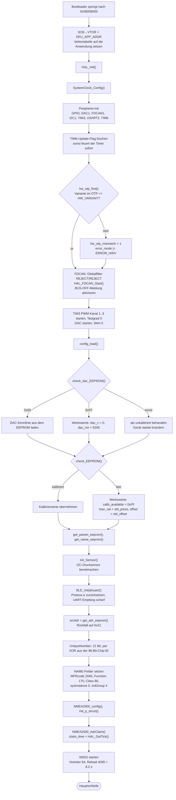
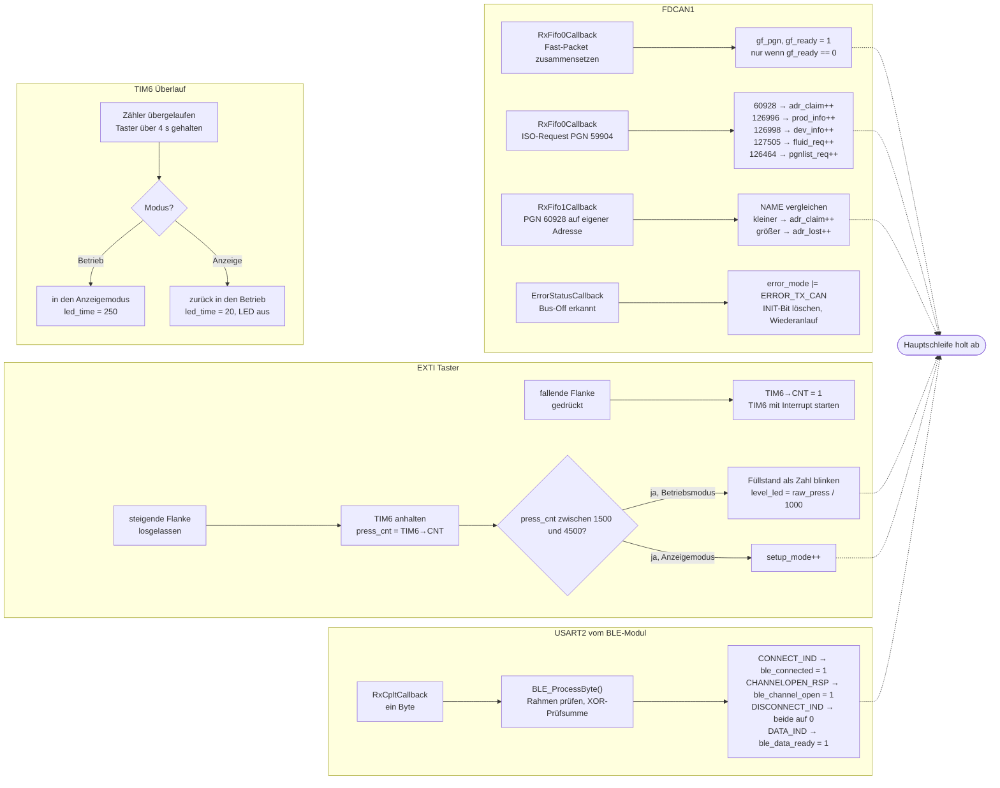
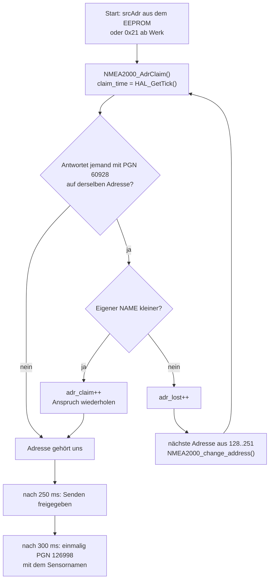

# Ablauf der Firmware

Was passiert wann? Dieses Dokument beschreibt den zeitlichen Ablauf der
Sensor-Firmware: vom Sprung aus dem Bootloader über die Initialisierung bis in
die Hauptschleife, und was die Interrupts nebenher tun.

Die Firmware kommt ohne Betriebssystem aus. Es gibt genau einen Ablauf-Faden –
die Hauptschleife in `main()` – und darin mehrere Zeitscheiben, die über
Vergleiche gegen `HAL_GetTick()` gesteuert werden. Kein Task-Wechsel, keine
Prioritäten, keine Semaphoren. Alles, was Interrupts betrifft, läuft nach dem
gleichen Muster ab: die Interrupt-Routine setzt eine Variable und ist fertig,
die Hauptschleife holt sie beim nächsten Durchlauf ab. Dadurch gibt es keine
Stelle, an der zwei Ausführungspfade gleichzeitig auf denselben Puffer
schreiben.

Wichtigster Quelltext: `Core/Src/main.c`. Die Nebenpfade liegen in
`Core/Src/nmea2000.c` (CAN-Empfang), `Core/Src/ble.c` (UART-Empfang),
`Core/Src/nmea_app.c` (Protokoll-Handler) und `Core/Src/ble_app.c`
(BLE-Textprotokoll).

---

## 1. Start

Der Bootloader liegt ab `0x08000000`, die Anwendung ab `0x08008000`. Nach dem
Sprung zeigt die Vektortabelle noch auf den Bootloader – die allererste Zeile in
`main()` rückt sie zurecht. Alles Weitere ist die übliche Reihenfolge:
Takt, Peripherie, Konfiguration aus dem EEPROM, Anmeldung am Bus, Watchdog.

### Was dabei bemerkenswert ist

Der **OTP-Vergleich** ist die einzige Prüfung, die den normalen Betrieb
einschränkt, ohne ihn abzubrechen. Passt die im OTP verankerte Hardware-Variante
nicht zu der, für die die Firmware übersetzt wurde, wird `hw_otp_mismatch`
gesetzt und `ERROR_HWV` gemeldet. Das Gerät läuft weiter, sendet aber keinen
Füllstand mehr – ein falsch skalierter Messwert wäre schlimmer als gar keiner.
Die Temperatur hängt an derselben Bedingung und entfällt damit ebenfalls. Der
Heartbeat geht weiterhin raus, damit das Gerät am Bus sichtbar bleibt und man
den Fehler überhaupt sieht.

Der **CAN-Globalfilter** steht auf REJECT/REJECT. Angenommen werden nur
Nachrichten, für die vorher ein Filter eingetragen wurde. Das hält die FIFOs
in einem gut belegten Netz frei.

Der **DAC-Zweig mit dem unerwarteten Wert** (weder `0x00` noch `0xFF`) war
früher eine Endlosschleife. Ein einzelnes verrutschtes Byte im EEPROM hat damit
gereicht, dass das Gerät nie gestartet ist. Jetzt gilt der Zustand als
unkalibriert und der Rest läuft normal an.

Der **Watchdog** wird bewusst als Letztes gestartet, nach dem Address Claim.
Die Initialisierung enthält I2C-Zugriffe mit Zeitgrenzen und eine Wartezeit auf
das BLE-Modul; ein früher gestarteter Watchdog müsste zwischendrin bedient
werden und würde genau die Fehler verdecken, gegen die er helfen soll. Ab dem
Eintritt in die Hauptschleife läuft er mit rund 8,2 Sekunden Nachlaufzeit.

---

## 2. Hauptschleife

Ein Durchlauf ist kurz und blockiert nirgends. Ganz oben wird der Watchdog
bedient, danach wird einmal `HAL_GetTick()` gelesen und dieser eine Zeitstempel
für alle folgenden Vergleiche verwendet – so kann eine Zeitscheibe nicht dadurch
verrutschen, dass eine frühere Scheibe im selben Durchlauf Zeit gekostet hat.

```mermaid
flowchart TD
    S(["Schleifenanfang"]) --> WD["IWDG bedienen (KR = 0xAAAA)"]
    WD --> T["time_el = HAL_GetTick()"]

    T --> M{"100 ms<br/>Messung fällig?"}
    M -- "ja" --> M1["ERROR_I2C löschen, Bus-Off erneut prüfen<br/>get_value: Druck und Temperatur über I2C<br/>Glättung in raw_press<br/>Prozentwert über Kennlinie, DAC ausgeben<br/>setup_mode 1: auf 100 Prozent kalibrieren<br/>setup_mode 2: Kalibrierung löschen"]
    M -- "nein" --> N1
    M1 --> N1{"2500 ms<br/>Füllstand fällig?"}

    N1 -- "ja" --> N1a{"hw_otp_mismatch == 0<br/>und seit Claim ≥ 250 ms?"}
    N1a -- "ja" --> N1b["NMEA2000_SendFluidLevel()<br/>PGN 127505"]
    N1a -- "nein" --> N2
    N1 -- "nein" --> N2
    N1b --> N2{"2000 ms<br/>Temperatur fällig?"}

    N2 -- "ja" --> N2x{"hw_otp_mismatch == 0<br/>und seit Claim ≥ 250 ms?"}
    N2x -- "ja" --> N2a["NMEA2000_SendTemperature()<br/>PGN 130312, Quelle 2"]
    N2x -- "nein" --> N3
    N2 -- "nein" --> N3
    N2a --> N3{"60000 ms<br/>Heartbeat fällig?"}

    N3 -- "ja" --> N3y{"seit Claim ≥ 250 ms?"}
    N3y -- "ja" --> N3a["NMEA2000_SendHeartbeat()<br/>PGN 126993"]
    N3y -- "nein" --> R
    N3 -- "nein" --> R
    N3a --> R["Anfragen und Ereignisse abarbeiten"]

    R --> R1["fluid_req → Füllstand sofort senden"]
    R1 --> R2["pgnlist_req → PGN-Liste senden"]
    R2 --> R3["adr_lost → nächste freie Adresse 128..251,<br/>NMEA2000_change_address(), neu anmelden,<br/>set_adr_eeprom()"]
    R3 --> R4["adr_claim → Adressanspruch wiederholen"]
    R4 --> R5["prod_info → PGN 126996"]
    R5 --> R6["boot_cfginfo_pending → 300 ms nach dem Claim<br/>einmalig PGN 126998"]
    R6 --> R7["dev_info → PGN 126998"]
    R7 --> R8{"gf_ready?"}
    R8 -- "126208" --> R8a["handle_group_function()"]
    R8 -- "126720" --> R8b["handle_prop_config()"]
    R8 -- "65240" --> R8c["handle_commanded_address()"]
    R8 -- "nein" --> B
    R8a --> B
    R8b --> B
    R8c --> B

    B["BLE"] --> B1{"ble_data_ready?"}
    B1 -- "ja" --> B1a["ble_handle_command()"]
    B1 -- "nein" --> B2
    B1a --> B2{"1000 ms und ble_channel_open?"}
    B2 -- "ja" --> B2a["ble_send_status()"]
    B2 -- "nein" --> B3
    B2a --> B3{"ble_setname_pending und nicht verbunden?"}
    B3 -- "ja" --> B3a["HAL_Delay(50)<br/>BLE_ApplyPendingName()"]
    B3 -- "nein" --> B4
    B3a --> B4["Boot-Abgleich ab 1500 ms:<br/>Schritt 0 Name, Schritt 1 Sicherheitsmodus,<br/>Schritt 2 fertig"]

    B4 --> L{"led_time abgelaufen?"}
    L -- "ja" --> L1["blink_LED()"]
    L -- "nein" --> S
    L1 --> S
```

### Die Zeitscheiben auf einen Blick

| Abstand | Was | Variable | Bedingung |
| --- | --- | --- | --- |
| 100 ms | Messen, glätten, DAC ausgeben | `tx_time` | – |
| 2500 ms | PGN 127505 Füllstand | `nmea_time` | kein OTP-Fehler, Claim ≥ 250 ms her |
| 2000 ms | PGN 130312 Temperatur | `temp_time` | kein OTP-Fehler, Claim ≥ 250 ms her |
| 60000 ms | PGN 126993 Heartbeat | `hb_time` | Claim ≥ 250 ms her |
| 1000 ms | BLE-Statuszeile | `ble_time` | Kanal offen |
| 1500 ms einmalig | BLE-Boot-Abgleich | `ble_sync_next` | Modul ist hochgelaufen |
| 20 ms / 250 ms | LED weiterschalten | `led_time` | Betriebs- oder Anzeigemodus |

Die 2,5 s für den Füllstand und die 2 s für die Temperatur sind die
Normintervalle der jeweiligen PGN. Die 250 ms nach dem Address Claim sind eine
Schutzzeit: solange die Anmeldung noch laufen kann, wird nichts unter dieser
Adresse gesendet, was ein anderes Gerät für sich beanspruchen könnte.

Die Glättung des Drucks ist ein gleitender Mittelwert erster Ordnung.
`wertung` ist dabei der Anteil des **alten** Werts in Promille: bei
`wertung = 50` gehen 95 % neuer Messwert und 5 % alter Wert in das Ergebnis
ein. Die Glättung ist also sehr schwach – bei 100 ms Abstand liegt die
Zeitkonstante bei rund 30 ms, der Filter fängt im Wesentlichen einzelne
Ausreißer ab. Wer Schwappen im Tank herausrechnen will, erhöht `wertung`;
bei 900 sind es 10 % neuer Wert je Durchlauf und knapp eine Sekunde
Zeitkonstante.

---

## 3. Interrupts

Vier Quellen unterbrechen die Hauptschleife. Keine von ihnen ruft eine
Sendefunktion auf oder wartet auf etwas. Sie schreiben ein Flag oder einen
Zähler und kehren zurück.

### Taster und TIM6

Der Systemtakt kommt vom internen HSI ohne PLL, also 16 MHz. TIM6 läuft mit
Vorteiler 2000 und Periode 32000: ein Schritt dauert damit rund 125 µs und der
Überlauf kommt nach etwa vier Sekunden. Der Zähler wird beim Drücken auf 1
gesetzt und beim Loslassen ausgelesen – der Zählerstand ist ein direktes Maß
für die Druckdauer.

Daraus ergeben sich drei Fälle. Unter 1500 Schritten, also knapp 190 ms, gilt
der Druck als Prellen und wird verworfen. Zwischen 1500 und 4500 Schritten,
also etwa 190 bis 560 ms, ist es ein kurzer, gewollter Druck; was er auslöst,
hängt vom Modus ab. Läuft der Sensor normal, blinkt er den aktuellen Füllstand
als Zahl. Ist er im Anzeigemodus, wird `setup_mode` weitergezählt und die
Hauptschleife führt in ihrer 100-ms-Scheibe die passende Aktion aus. Überläuft
der Timer nach vier Sekunden, bevor der Taster wieder losgelassen wurde, war es
ein langer Druck – dann wechselt der Modus.

Dass der Timer erst beim Drücken gestartet und beim Loslassen wieder angehalten
wird, hat einen praktischen Grund: es gibt keinen freilaufenden Zähler, der
nebenher Interrupts erzeugt, und keinen Zustand, der zwischen zwei Tastendrücken
verwaltet werden müsste.

### Die Übergabe vom Interrupt zur Hauptschleife

Für die Fast-Packet-Daten gibt es genau einen Puffer. Die Empfangsroutine
schreibt nur hinein, wenn `gf_ready` noch 0 ist – die Hauptschleife also das
letzte Paket bereits abgeholt hat. Ein zweites Paket, das eintrifft, bevor
das erste verarbeitet wurde, geht verloren. Das ist gewollt: ein halb
überschriebener Puffer wäre deutlich unangenehmer als eine verlorene Anfrage,
und die Gegenstelle wiederholt ohnehin.

Für die BLE-Nutzdaten gilt dasselbe mit `ble_data_ready`. Die anderen Ereignisse
sind Zähler statt Flags (`adr_claim`, `fluid_req`, `dev_info` und die übrigen),
weil dort mehrere Anfragen kurz hintereinander eintreffen können und jede eine
eigene Antwort verdient.

---

## 4. Address Claim im Detail

Die Adressvergabe ist der einzige Ablauf, der sich über mehrere
Schleifendurchläufe erstreckt und dabei den Zustand ändert.

Der kleinere NAME gewinnt – so steht es in der Norm. Weil der NAME die aus der
Chip-ID abgeleitete `UniqueNumber` enthält, ist er für jedes Gerät verschieden
und die Entscheidung damit immer eindeutig. Die 96 Bit der Chip-ID werden dazu
per XOR auf 32 Bit zusammengefaltet (`uid = w0 ^ w1 ^ w2`) und daraus die
21 Bit gebildet, die das Feld hergibt (`u21 = (uid ^ (uid >> 21)) & 0x1FFFFF`);
eine Null wird zu Eins gemacht, weil 0 als ungültig gilt. Die gewonnene Adresse wird ins
EEPROM geschrieben, damit der Sensor nach dem nächsten Einschalten dieselbe
Adresse wieder versucht und das Netz nicht jedes Mal neu durchgemischt wird.

Ein Plotter kann die Adresse auch von außen vorgeben (PGN 65240, Commanded
Address). `handle_commanded_address()` prüft zuerst, ob der mitgeschickte NAME
der eigene ist und ob die geforderte Adresse überhaupt gültig ist – 252 bis 255
sind reserviert –, und meldet sich erst dann unter der neuen Adresse an.

---

## 5. Wenn etwas schiefgeht

`error_mode` sammelt die Fehlerbits; die LED zeigt sie an und die BLE-Statuszeile
gibt sie aus.

`ERROR_I2C` wird zu Beginn jeder Messscheibe gelöscht und von `get_value()`
neu gesetzt, wenn der Sensor nicht antwortet. Der Fehler steht also immer für
die letzten 100 ms und nicht für irgendwann. Fällt eine Messung aus, liefert
`get_value()` den letzten gültigen Wert zurück, statt eine Null in die Glättung
zu geben.

`ERROR_TX_CAN` kommt aus `HAL_FDCAN_ErrorStatusCallback`, wenn der Controller
in den Bus-Off-Zustand gegangen ist. Die Interrupt-Routine löscht das INIT-Bit
und stößt damit den Wiederanlauf an; die Messscheibe prüft anschließend, ob der
Bus wieder da ist, und löscht das Bit dann.

`ERROR_HWV` steht für den OTP-Vergleich aus der Startphase und bleibt bis zum
nächsten Einschalten stehen. Er lässt sich im Betrieb nicht beheben, weil das
OTP nur einmal beschrieben werden kann.

Bleibt die Hauptschleife irgendwo hängen, greift nach rund 8,2 Sekunden der
Watchdog und der Sensor startet neu – über den Bootloader, der dann wieder in
die Anwendung springt und den Ablauf von vorn beginnt.
